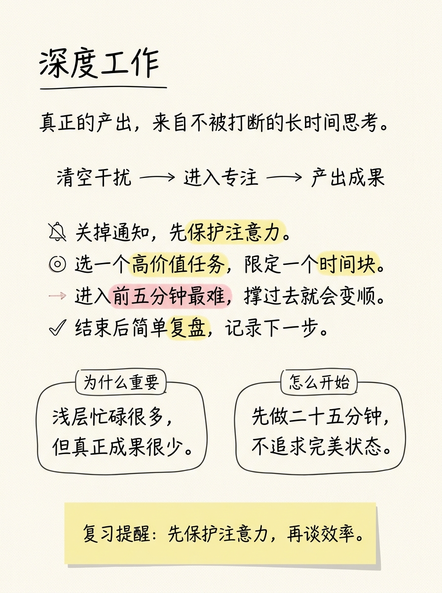
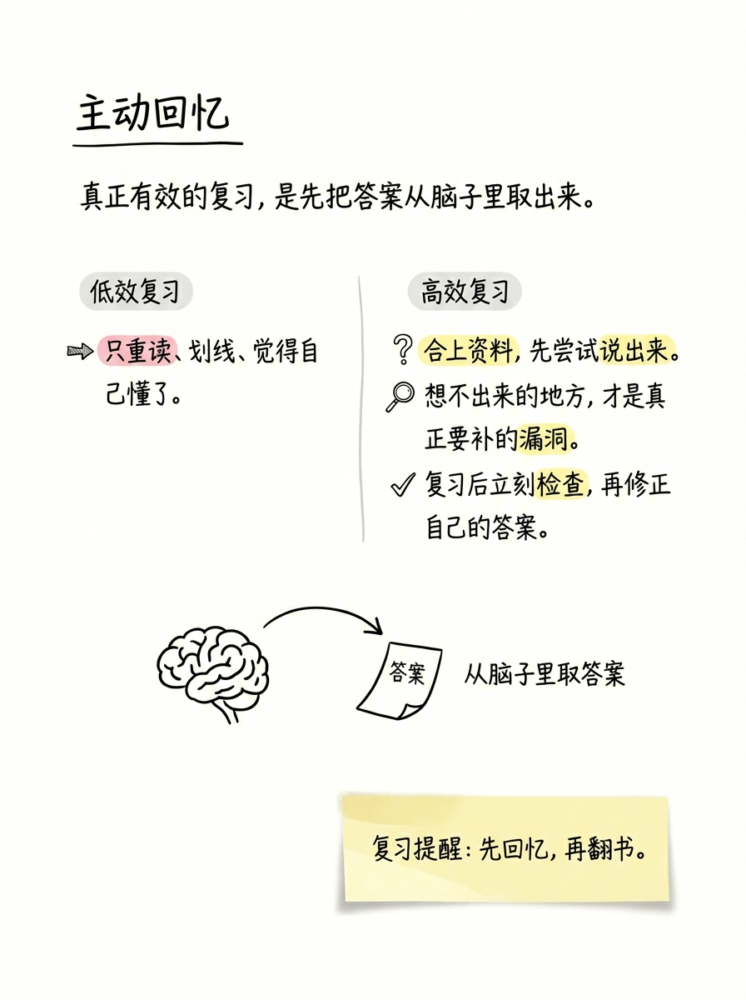
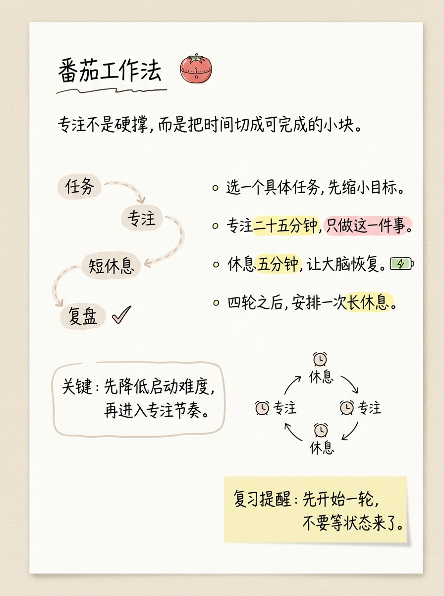
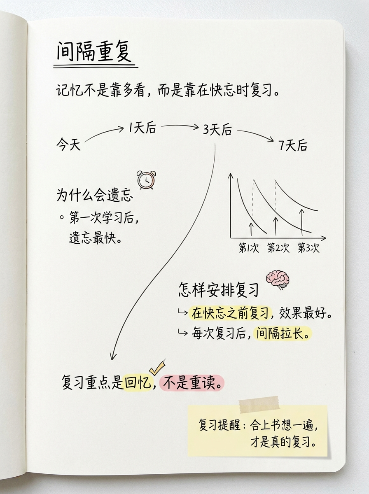
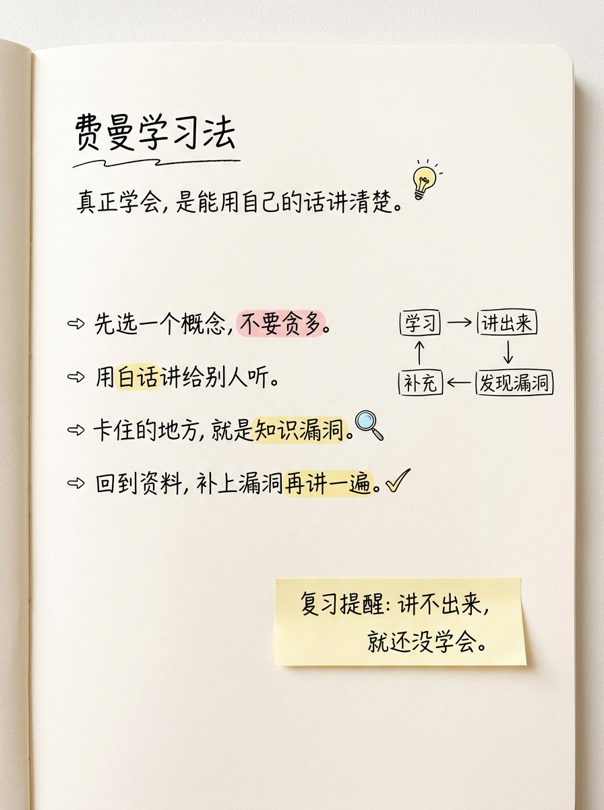
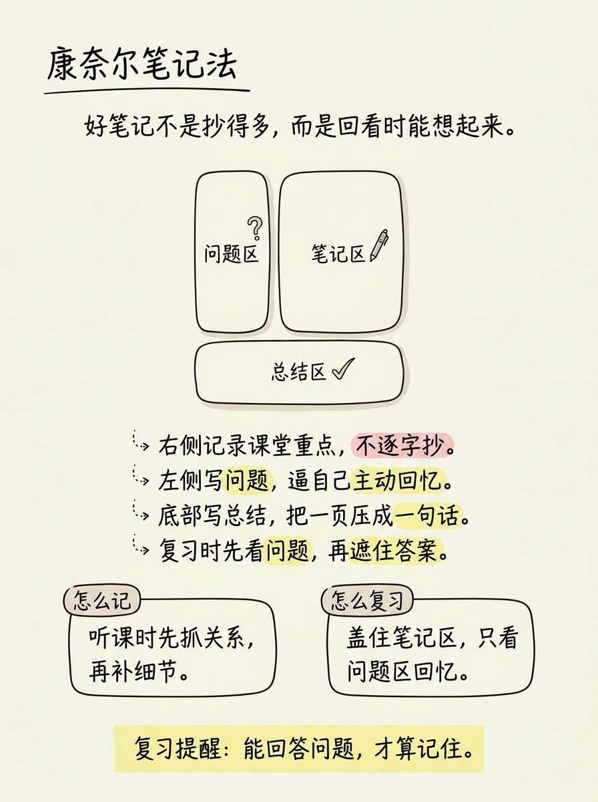

# Study Notes Studio

**Study Notes Studio** 把课堂、网课、讲座、读书摘录和复习材料，整理成一张张漂亮、有重点、能复习的视觉学习笔记。

全画布学习笔记页 | 手写风格 | 高亮重点 | 图解结构 | 复习提醒 | Codex Skill

## 这个仓库是什么

Study Notes Studio 是一个 Codex Skill，用来指导 AI Agent 把学习材料整理成高质量视觉笔记。

它不是普通的图片 prompt，不是 PPT 信息图模板，也不是简单地把原文换成手写字体。它会先理解内容中真正值得记住的部分，再把定义、结构、流程、对比、误区和复习提醒组织成一张清爽、有重点、看完有收获的学习笔记页。

默认交付是一张 **严格 3:4 竖版全画布总览学习笔记图**。整张画布本身就是笔记页，不生成笔记本背景、纸张边缘、桌面、投影或样机效果。只有用户明确要求多页时，才进入逐页生成流程。

> 让 AI 不只是在“整理内容”，而是在制作真正适合复习的学霸笔记。

## 适合谁用

- 上网课、听课或听讲座后，想快速整理笔记的人
- 想把复杂知识点做成一页复习图的人
- 做读书笔记、课程笔记、播客笔记的人
- 做知识型小红书、公众号、Notion 内容的人
- 想用 Codex 稳定复用一套学习笔记生成流程的人
- 做知识产品、资料包或课程复习页的人

它不适合商业海报、品牌 KV、传统 PPT 信息图、儿童手账或需要严格可编辑 SVG / Figma / PPT 源文件的场景，也不建议把整节课或大段教材硬塞进一张图。

## 它会产出什么

默认输出：

- 1 张严格 3:4 竖版总览学习笔记图
- 一页一个主题
- 3-5 个核心要点
- 2-4 个关键词高亮
- 60-90 个可见汉字
- 一个小图解、流程、对比或结构示意
- 一句复习提醒
- 最终 PNG 图片

如果用户明确要求多页，Skill 会先生成 `page-outline` 和 `page-prompts`，再逐页单独生图。每次工具调用只生成一页，并在页与页之间报告进度，避免后续页面卡住。

也可以明确要求只输出笔记规划，包括每页标题、内容类型、推荐版式、核心要点、高亮关键词、图解建议和复习提醒。

默认不输出 PPTX、PDF、Keynote、SVG、HTML、Canvas、课程讲义或长篇文字总结。

## 视觉风格

这个 Skill 默认使用 **全画布学习笔记页** 风格：

- 3:4 竖版，浅奶白、极浅米白、纯白画布丨视版本而定
- 整张图片就是笔记页本身，不要纸张边缘和周围背景
- 不要桌面、投影、笔记本书脊或真实便利贴样机感
- 黑色手写笔记字体，少量黄色高亮关键词
- 少量粉色高亮误区或对比点
- 用留白、小标签和柔和手绘容器分区
- 用小图解表达结构、流程、对比或关系
- 复习提醒使用平面浅黄色提示色块

一张图只讲一个学习主题。目标不是“好看但空”，而是：

> 第一眼看到主题，第二眼抓住重点，看完能真正复习。

## 示例效果

以下样图展示 Study Notes Studio 的默认输出方向。它们是风格校准示例，不是固定模板；每次生成时，Skill 都会根据学习内容重新组织信息结构和版式。

### 深度工作



### 主动回忆



### 番茄工作法



### 间隔重复



### 费曼学习法



### 康奈尔笔记法


还适合生成批判性思维、供需关系、RAG 工作流、机器学习基础概念、读书章节复盘、课程小节总结和考试易错点等视觉笔记。

## 安装

克隆仓库：

```bash
git clone https://github.com/yxxx6666/study-notes-studio.git
cd study-notes-studio
```

复制 Skill 到 Codex skills 目录：

```bash
mkdir -p "${CODEX_HOME:-$HOME/.codex}/skills"
cp -R . "${CODEX_HOME:-$HOME/.codex}/skills/study-notes-studio"
```

Windows PowerShell：

```powershell
New-Item -ItemType Directory -Force "$HOME\.codex\skills" | Out-Null
Copy-Item -Recurse -Force . "$HOME\.codex\skills\study-notes-studio"
```

安装后，在 Codex 中这样使用：

```text
Use $study-notes-studio 把这段内容整理成一页漂亮的学习笔记。
```

升级已有安装时，不要只保留新版 ZIP：还需要用新版 `study-notes-studio` 文件夹替换实际安装目录中的旧 Skill，例如 `$HOME/.codex/skills/study-notes-studio`。

## 使用方法

在 Codex 中直接发送：

```text
/imagegen $study-notes-studio 把下面内容整理成学习笔记，3:4 比例。
（原文正文直接粘在这里）
```

说明：
- `/imagegen` 强制使用图片生成模型
- `$study-notes-studio` 调用本 Skill
- 页数由 Skill 根据内容自动判断，无需手动指定
- 生成后会自动检查比例，不符合 3:4 会自动重试

当前版本：v1.4.1

## 怎么用

### 只做笔记规划

```text
Use $study-notes-studio 先不要生图。
请把下面这段课程内容拆成 2-3 页学习笔记方案。
每页写清楚：标题、内容类型、核心要点、高亮关键词、图解建议和复习提醒。

<粘贴课程内容>
```

### 直接生成学习笔记图

```text
Use $study-notes-studio 把下面这段内容生成一页学习笔记图。

要求：
- 3:4 竖版
- 全画布学习笔记页
- 不要笔记本背景、纸张边缘和投影
- 重点清楚，适合复习

<粘贴内容>
```

### 为单个概念生成一张图

```text
Use $study-notes-studio 为“主动回忆”生成一张学习笔记图。
解释它是什么、为什么有效、怎么使用。
要有一个小图解和一句复习提醒。
```

### 整理读书笔记

```text
Use $study-notes-studio 把下面这段读书摘录整理成一页视觉学习笔记。
不要逐句摘抄，请提炼真正值得复习的结构、概念和提醒。

<粘贴摘录>
```

### 整理考试易错点

```text
Use $study-notes-studio 把下面这些易错点整理成一页复习笔记。
重点突出：常见错误、正确理解、记忆提醒。

<粘贴易错点>
```

```text
也可以只直接：Use $study-notes-studio 请把下面内容整理成学习笔记图：

<粘贴长文、原文，会自动整理>
```

## 工作流程

1. 读取课堂内容、文章、转写、摘录或用户给出的主题
2. 判断内容类型：定义、流程、对比、分类、公式、案例或易错点
3. 提炼 3-5 个真正值得复习的要点
4. 找出 2-4 个关键词用于高亮
5. 选择最适合的笔记版式
6. 设计一个小图解表达知识关系
7. 写一句复习提醒
8. 默认生成 1 张严格 3:4 总览学习笔记图
9. 多页任务先生成 `page-outline` 和 `page-prompts`，再逐页单独生成并报告进度
10. 单页超时后只降载重试一次；文字出错时先减字再重生
11. 按学习价值、信息结构、视觉审美、可读性和原创感检查结果

## 目录结构

```text
study-notes-studio/
├── README.md
├── SKILL.md
├── VERSION.md
├── CHANGELOG.md
├── RELEASE_REPORT.md
├── LICENSE
├── agents/
│   └── openai.yaml
├── examples/
│   └── images/
└── handbook/
    ├── generation-protocol.md
    ├── execution-stability.md
    ├── layout-recipes.md
    ├── learning-compression.md
    ├── page-grammar.md
    ├── review-rubric.md
    └── visual-style.md
```

## 版本

当前版本：**v1.4.1**

### v1.4.1

- 出图默认且强制使用图片生成模型，不因中文可读、比例可控等理由切换到 Pillow / HTML。
- 所有模式出图前先做内容前置理解：识别类型、抽取计数、决定结构、正规化。
- 标题中的数量必须和画面实际呈现项数一致，合并成大类时要明确标注映射。
- 页码、内部约束、prompt 说明、审计术语等不得画进图片，只能用于文件名或交付说明。

### v1.4.0

- 新增总览笔记、长文配图、完整笔记三种模式路由。
- 用户要求完整、不遗漏、覆盖全文时，进入完整笔记模式并执行知识点覆盖矩阵审计。
- 每页加入一个原创学习锚点图案，用普通学习物件、路径符号、记忆符号或抽象结构符号增强记忆。
- 默认视觉升级为清爽彩色手写学习笔记：黑笔骨架、荧光黄关键词、浅蓝分区、浅绿结论、浅粉/红色提醒、淡橙路径。
### v1.2.2

- 修复“整理成学习笔记”默认只输出规划、不生成图片的问题
- 修复多页生成时第二页或后续页面容易卡住的问题
- 修复比例漂移到 2:3 / A4 的问题，强制 final prompt 使用严格 3:4 竖版
- 默认交付改为 1 张 3:4 总览学习笔记图
- 多页任务改为 `page-outline → page-prompts → 逐页单独生成`
- 每次工具调用只生成一页，并逐页报告进度
- 图上中文默认控制在 60-90 个可见汉字
- 单页超过 180 秒后只允许降载重试一次
- 图中文字出错时先减少文字量再重生
- 新增 `handbook/execution-stability.md`、`CHANGELOG.md` 和 `RELEASE_REPORT.md`
- 新增安装位置核验，升级时需替换实际安装目录中的旧 Skill

### v1.2.1

- 复习提醒默认改为平面提示色块
- 不生成真实便利贴
- 不生成胶带、翘角、投影、浮起效果或 3D 贴纸感
- 提醒块直接画在同一画布中

### v1.2.0

- 默认背景从“单页纸张”升级为“全画布学习笔记页”
- 整张图片画布本身就是笔记页
- 不生成纸张边缘、纸张外框、周围背景或投影
- 避免纸张样机感

完整记录见 [`VERSION.md`](VERSION.md)。

## 注意事项

- 图片里的中文越短越稳定，一页只讲一个主题。
- 不要把原文逐句抄进去，要提炼真正值得复习的内容。
- 高亮只用于关键词，不要整句整段涂色。
- 图解必须服务理解，不要为了装饰而画图。
- AI 图像模型可能出现错字、漏字、幻觉标签或排版漂移。
- 如果页面像 PPT、讲义或海报，说明笔记感不够，需要重新生成。

## 设计目标

一张合格的 Study Notes Studio 笔记应该让读者先看到主题，再抓住核心判断，然后理解结构，最后记住复习提醒。

最终判断标准：

> 如果我是学生，考前愿不愿意拿这页来复习？

## License

MIT License.
